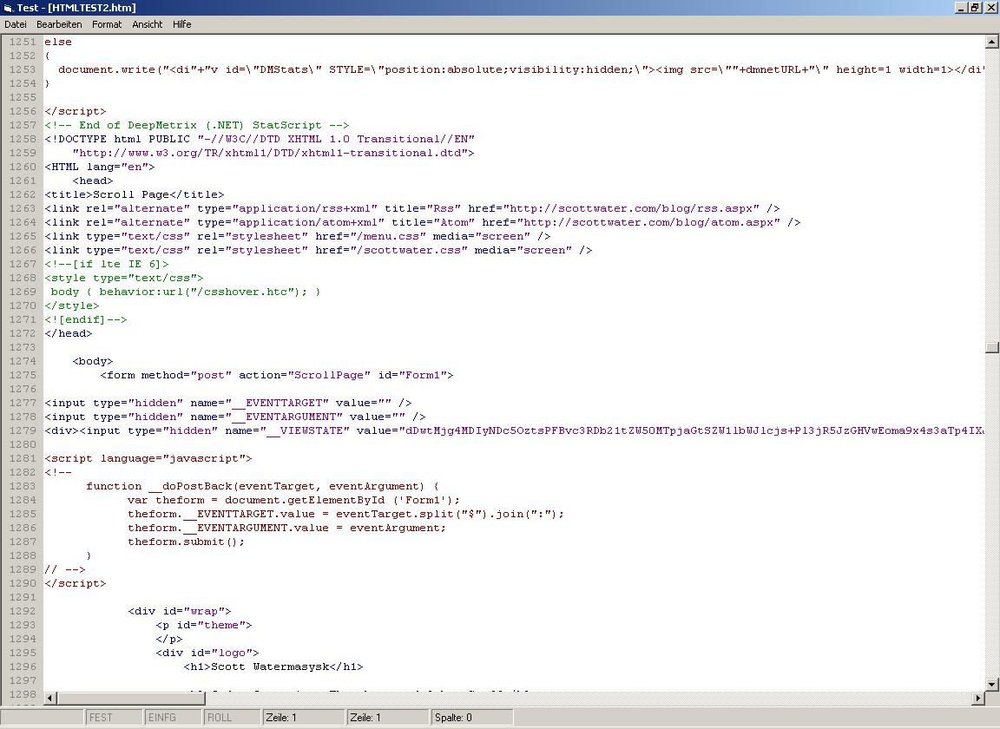

<div align="center">

## Codebox V1\.0


</div>

### Description

This is a syntax highlighting codebox for almost every programming language you want. You can easily create new syntax shemes, if you want.

The highlighting algo isn't super fast, but much faster than many other examples, because it modifies directly RTF source, not the visible text.

If someone has any suggestions to improve this control or make the algo faster, then please tell me.

Hint: You will need SSubTmr6.dll from vbaccelerator to run the control. You can download it from:

http://www.vbaccelerator.com/home/VB/Code/Libraries/Subclassing/SSubTimer/VB6_SSubTmr_Binary.asp

Don't forget to register DLL before, otherwise it won't work.

Sample and Comments are in German.
 
### More Info
 


<span>             |<span>
---                |---
**Submitted On**   |2004-10-12 21:57:16
**By**             |[MPCole](https://github.com/Planet-Source-Code/PSCIndex/blob/master/ByAuthor/mpcole.md)
**Level**          |Intermediate
**User Rating**    |3.8 (23 globes from 6 users)
**Compatibility**  |VB 6\.0
**Category**       |[String Manipulation](https://github.com/Planet-Source-Code/PSCIndex/blob/master/ByCategory/string-manipulation__1-5.md)
**World**          |[Visual Basic](https://github.com/Planet-Source-Code/PSCIndex/blob/master/ByWorld/visual-basic.md)
**Archive File**   |[Codebox\_V118046410132004\.zip](https://github.com/Planet-Source-Code/mpcole-codebox-v1-0__1-56711/archive/master.zip)

### API Declarations

```
Private Declare Function SendMessage Lib "user32" Alias "SendMessageA" (ByVal hwnd As Long, ByVal wMsg As Long, ByVal wParam As Long, lParam As Any) As Long
Private Declare Function SendMessageLong Lib "user32" Alias "SendMessageA" (ByVal hwnd As Long, ByVal wMsg As Long, ByVal wParam As Long, ByVal lParam As Long) As Long
Private Declare Function LockWindowUpdate Lib "user32" (ByVal hwndLock As Long) As Long
Private Declare Function InvalidateRectAsNull Lib "user32" Alias "InvalidateRect" (ByVal hwnd As Long, ByVal lpRect As Long, ByVal bErase As Long) As Long
Private Declare Function GetScrollPos Lib "user32" (ByVal hwnd As Long, ByVal nBar As Long) As Long
Private Declare Function SetScrollPos Lib "user32" (ByVal hwnd As Long, ByVal nBar As Long, ByVal nPos As Long, ByVal bRedraw As Long) As Long
Public Declare Function GetPrivateProfileString Lib "kernel32" Alias "GetPrivateProfileStringA" (ByVal lpApplicationName As String, ByVal lpKeyName As Any, ByVal lpDefault As String, ByVal lpReturnedString As String, ByVal nSize As Long, ByVal lpFileName As String) As Long
```


